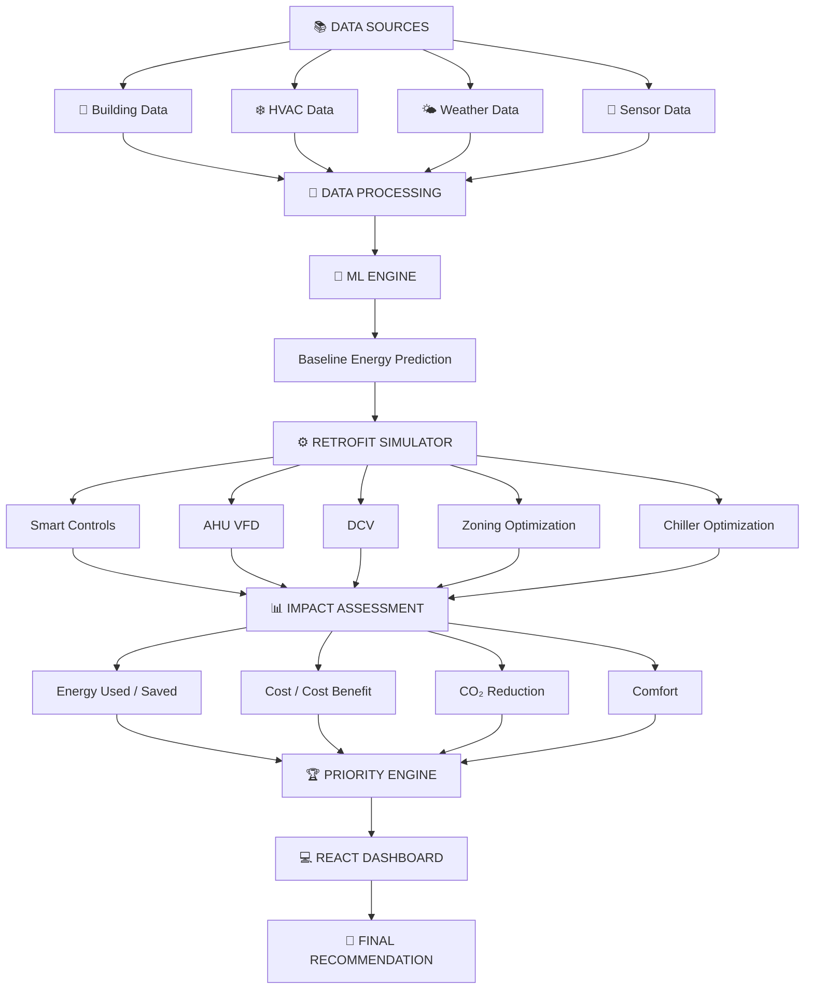

# ⚡ RETROFITIQ

## HVAC Retrofit Recommendation & Simulation Engine

> **From HVAC data to intelligent retrofit decisions.**

RetrofitIQ is a data-driven decision-support system that analyzes building and HVAC performance, predicts energy consumption, evaluates retrofit strategies, and recommends the most suitable intervention based on **energy, cost, CO₂, comfort, feasibility, maintenance, and urgency**.

**🏆 Round 2 | 🚧 Development in Progress | VIT Chennai**

---

# 🎯 What Are We Building?

RetrofitIQ answers one simple question:

> **Which HVAC retrofit should this building implement first — and why?**

Instead of giving a generic recommendation, RetrofitIQ aims to simulate different retrofit scenarios and compare their expected impact.

### The End Goal

**Building → Analyze → Predict → Simulate → Compare → Rank → Recommend**

---

# 📌 Current Status

| Area | Status |
|---|:---:|
| Dataset Collection | ✅ Done |
| Parameter Selection | ✅ Done |
| Data Cleaning | ✅ Done |
| Data Reprocessing | ✅ Done |
| GitHub Setup | ✅ Done |
| ML Problem Definition | 🔄 In Progress |
| Baseline ML Model | 🔄 In Progress |
| Retrofit Simulation | 🔄 In Progress |
| Impact Calculation | ⏳ Planned |
| Ranking Engine | ⏳ Planned |
| React Dashboard | ⏳ Planned |
| Full Integration | ⏳ Planned |

---

# 🧠 System Overview


---

# 📚 Data

Datasets cover different aspects of HVAC and building performance:

- 🏢 Building characteristics
- 🌤️ Weather & climate
- ❄️ HVAC systems
- ⚡ Energy consumption
- 🌡️ Indoor conditions
- 👥 Occupancy
- 📡 HVAC sensor data
- 🔄 Pre/post-retrofit performance

Datasets are processed separately where appropriate rather than forcing unrelated data into one model.

---

# 🤖 Machine Learning

## Goal

Build a reliable and explainable **baseline energy prediction model**.

### Workflow

```text
Cleaning
   ↓
EDA
   ↓
Feature Selection
   ↓
X/y Definition
   ↓
Training
   ↓
Evaluation
   ↓
Best Model
```

Potential predictions include:

- ⚡ Post-retrofit energy
- 💡 Energy savings
- 🌱 CO₂ reduction

The final target will be selected after exploratory analysis.

> **Important:** We will prioritize a reliable and explainable baseline model before experimenting with more complex ML approaches.

---

# ⚙️ Retrofit Strategies

| Retrofit | Purpose |
|---|---|
| 🎛️ **Smart Controls** | Optimize schedules and setpoints |
| 🌀 **AHU VFD** | Adjust fan speed to demand |
| 🌬️ **DCV** | Match ventilation to occupancy |
| 🏢 **Zoning Optimization** | Optimize individual zones |
| ❄️ **Chiller Optimization** | Improve chiller efficiency |

Simulation approaches are currently under evaluation, including **Python modelling, EnergyPlus, SimScale, ML-assisted, and hybrid approaches**.

> Prototype assumptions will be clearly identified and will not be presented as physics-accurate results.

---

# 📈 Impact Analysis

Each retrofit is compared against the baseline.

### ⚡ Energy Saved

```text
Energy Saved = Baseline Energy − Retrofit Energy
```

### 📊 Energy Saving %

```text
Energy Saving % =
(Energy Saved / Baseline Energy) × 100
```

### 💰 Cost Benefit

```text
Cost Benefit = Baseline Cost − Retrofit Cost
```

### 🌱 CO₂ Reduction

```text
CO₂ Reduction = Baseline CO₂ − Retrofit CO₂
```

### 🌡️ Comfort

Where data is available, comfort will also consider:

- Temperature
- Relative humidity
- Zone temperature
- Setpoint deviation

---

# 🏆 Priority Engine

RetrofitIQ will rank interventions using:

- ⚡ Energy
- 🌡️ Comfort
- 💰 Cost Benefit
- 🌱 Sustainability
- 🔧 Maintenance
- 🏗️ Feasibility
- 🚨 Urgency

## Priority Score

```text
Priority =
w₁(Energy) +
w₂(Comfort) +
w₃(Cost Benefit) +
w₄(Sustainability) +
w₅(Maintenance) +
w₆(Feasibility) +
w₇(Urgency)
```

Weights will be refined during development.

> **Current rankings are conceptual. Final scores will be generated by the implemented system.**

---

# 💻 Dashboard

The React dashboard will allow users to:

1. 🏢 Select a building
2. 📊 View current performance
3. 🤖 Generate baseline predictions
4. ⚙️ Select a retrofit
5. 🔬 Run a simulation
6. 📈 Compare results
7. 🏆 View retrofit rankings
8. 🥇 Get a final recommendation

### Key Outputs

**Energy • Savings • Cost • CO₂ • Comfort • Priority Score • Recommendation**

---

# 🏗️ Architecture



---

# 🗂️ Repository Structure

```text
RetrofitIQ/
├── data/
│   ├── raw/
│   ├── cleaned/
│   └── processed/
│
├── notebooks/
│   ├── 01_data_analysis.ipynb
│   ├── 02_feature_analysis.ipynb
│   └── 03_ml_model.ipynb
│
├── src/
│   ├── preprocessing/
│   ├── features/
│   ├── models/
│   ├── simulation/
│   └── ranking/
│
├── models/
├── backend/
├── frontend/
├── reports/
├── requirements.txt
└── README.md
```

---

# 🗺️ Roadmap

## Phase 1 — Data Foundation

- [x] Dataset collection
- [x] Parameter selection
- [x] Data cleaning
- [x] Data reprocessing
- [x] GitHub setup

## Phase 2 — ML Baseline

- [ ] Define ML problem
- [ ] Define X and y
- [ ] Perform EDA
- [ ] Train baseline models
- [ ] Evaluate models
- [ ] Select best model
- [ ] Save trained model

## Phase 3 — Retrofit Simulation

- [ ] Select simulation approach
- [ ] Define baseline behaviour
- [ ] Define retrofit parameters
- [ ] Simulate retrofit scenarios
- [ ] Validate assumptions

## Phase 4 — Impact & Ranking

- [ ] Calculate energy usage
- [ ] Calculate energy savings
- [ ] Calculate cost benefit
- [ ] Calculate CO₂ reduction
- [ ] Evaluate comfort
- [ ] Evaluate feasibility
- [ ] Implement priority scoring
- [ ] Generate retrofit ranking

## Phase 5 — React Dashboard

- [ ] Create dashboard
- [ ] Building selection
- [ ] Performance overview
- [ ] Retrofit selection
- [ ] Simulation interface
- [ ] Results visualization
- [ ] Retrofit comparison
- [ ] Ranking display
- [ ] Recommendation display

## Phase 6 — Integration

- [ ] Connect ML model
- [ ] Connect simulation engine
- [ ] Connect ranking engine
- [ ] Connect React frontend
- [ ] End-to-end testing
- [ ] Final demonstration

---

# 🚨 Development Principle

When unsure what to build next:

**Data → ML → Baseline → Simulation → Impact → Ranking → Dashboard**

> **Do not build the dashboard before the core calculations work.**

### We Will Avoid

- ❌ Inventing missing data
- ❌ Hardcoded recommendations
- ❌ Fake ML accuracy
- ❌ Forcing unrelated datasets together
- ❌ Unnecessary deep learning
- ❌ Presenting assumptions as real simulations
- ❌ Building UI before the core engine
- ❌ Adding AI/LLMs without a meaningful purpose

---

# 🛠️ Tech Stack

### Data & ML

**Python • Pandas • NumPy • Scikit-learn**

### Frontend

**React**

### Simulation

**EnergyPlus • SimScale • Python • Hybrid Approaches**

*Final simulation approach is under evaluation.*

---

# 👥 Team Prehistoric Humans

### Vellore Institute of Technology, Chennai

- **Jaagriti Mandal**
- **Swati Yadav**
- **Ashita Kuchhal**
- **Aneesha Yadav**

---

# 🚀 RetrofitIQ

## HVAC Data → ML Prediction → Retrofit Simulation → Impact Analysis → Intelligent Recommendation

**🏆 Round 2 — Development in Progress**
